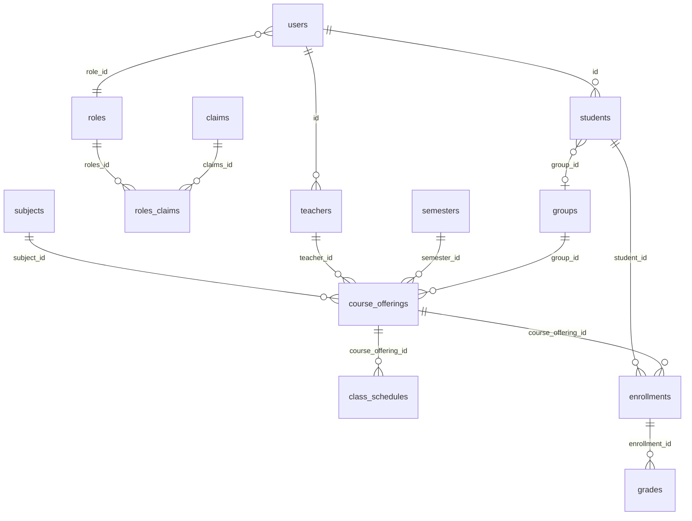

# Student Grading System

University grading backend (Spring Boot) and admin UI (React). Students and teachers are users via JOINED inheritance; **username** is the student/teacher identifier (there is no separate `student_no` / employee number).

## Technologies

- Java 25, Spring Boot 4, Spring Security, Spring Data JPA
- PostgreSQL 16, Redis, Flyway
- JWT authentication, role/claim authorization
- MapStruct, Bean Validation, springdoc OpenAPI
- React + Vite frontend, Docker Compose

## How to run locally

1. Start PostgreSQL and Redis (or use Docker Compose below).
2. Set environment variables (see Database connection).
3. Run the backend from the project root:

```bash
./gradlew bootRun
```

On Windows PowerShell:

```powershell
.\gradlew.bat bootRun
```

4. Frontend (optional):

```bash
cd frontend
npm install
npm run dev
```

Default admin login: `admin` / `admin`.

Swagger UI: [http://localhost:8080/swagger-ui/index.html](http://localhost:8080/swagger-ui/index.html)

## Database connection

Environment variables used by `application-db.yml`:

| Variable | Example |
|---|---|
| `SPRING_DATASOURCE_URL` | `jdbc:postgresql://localhost:5432/student_grading` |
| `SPRING_DATASOURCE_USERNAME` | `postgres` |
| `SPRING_DATASOURCE_PASSWORD` | `postgres` |
| `SPRING_REDIS_HOST` | `localhost` |
| `JWT_SECRET_KEY` | Base64-encoded secret |
| `JWT_EXPIRATION_MS` | `86400000` |

## Flyway migrations

Migrations live in `src/main/resources/db/migration`.

- Flyway runs on startup before Hibernate.
- `V1__class_schedules_constraints_and_audit.sql` adds class schedules, enrollment status timestamps, grade audit columns, and unique indexes.
- Hibernate `ddl-auto=update` still creates remaining entity tables on a fresh database.
- Seed data (roles, claims, admin user) is applied by `DbConfig` on startup.

To apply only migrations against an existing database, start the application; Flyway uses `baseline-on-migrate=true` and `baseline-version=0`.

## Docker

```bash
docker compose up --build
```

This starts PostgreSQL, Redis, backend (`:8080`) and frontend (`:3000`).

## Database structure

JOINED inheritance: `students.id` and `teachers.id` are the same as `users.id`.



Unique constraints:

- `users.username`, `users.email`
- `subjects.code`
- `enrollments (student_id, course_offering_id)`
- `roles_claims (roles_id, claims_id)`

## API overview

Auth is JWT (`Authorization: Bearer <token>`). Main resources:

| Method | Path | Notes |
|---|---|---|
| POST | `/auth/login` | Login |
| CRUD | `/students`, `/teachers`, `/groups`, `/subjects`, `/semesters`, `/course-offerings`, `/enrollments`, `/grades`, `/class-schedules` | 201 create, 204 delete |
| GET | `/students?name=&username=&firstName=&lastName=&groupId=` | Search/filter (username instead of student_no) |
| GET | `/students/{id}/transcript` | Final scores calculated in backend |
| GET | `/reports/courses/{courseId}/average-score` | `courseId` = course offering id |
| GET | `/reports/courses/{courseId}/top-students` | Top 5, descending |
| GET | `/reports/students/{studentId}/average-score` | Student average |

Final score weights (single calculator: `FinalScoreCalculator`):

- QUIZ 10% + ASSIGNMENT 20% + MIDTERM 30% + FINAL 40%

Role rules:

- ADMIN — full access
- TEACHER — only own course offerings, enrollments, students, and grades
- STUDENT — only own enrollments, grades, and transcript

Grade audit fields: `createdBy`, `updatedBy`, `createdAt`, `updatedAt`.

SQL assignment queries: `sql/queries.sql`.  
Postman collection: `postman/Student-Grading-System.postman_collection.json`.
